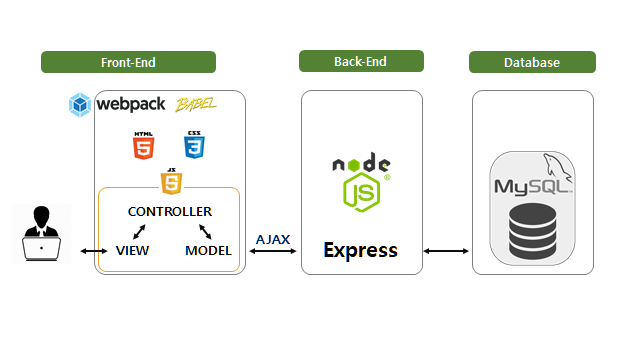

# parkinglot-mvc-and-webpack

# 주차정산시스템 리팩토링🚚
-----
## 목적

  1. 미니 프로젝트로 구현했던 주차정산시스템을 MVC 패턴으로 리팩토링한다.
  2. 자바스크립트에 대한 이해를 높인다.
  3. css에 대한 이해를 높인다.

## 기술스팩
  - Vanilla.js, CSS3, HTML5
  - Webpack, Babel
  - Node.js, express
  - MySQL

## 아키텍쳐
  🔸 FRONT-END 디자인패턴: MVC, OOP 🔸
  👉 Model : 데이터 상태 관리, 검증, api
  👉 View : ui components, action event emit
  👉 Controller: View 와 Model 에 data  혹은 action 전달
  👉 Utils : 
      - 엘레먼트 관련 공통 로직 custom hooks 
      - css root에 global style 정의
  

 

## 기능
  🟠 관리자 페이지 🟠
   
    - 로그인 상태만 접근할 수 있다.
     
    * 🚩회원관리🚩
    - 회원 `등록`&`수정`을 할 수 있다.
      - 계약기간 내 기존 회원 가입 방지
      - 차량번호 중복 가입 방지
      - 만료일은 가입일 이후로 부터 설정가능
      - 입력 데이터 유효성 검사
      - 모두 유효한 정보일 때만 서버에 데이터 전송 가능
       
    - 회원 `조회`를 할 수 있다.
      - 검색 데이터 유효성 검사
      - 조건에 따른 정보 필터
       
    - 회원 `삭제`를 할 수 있다.
      - 삭제 후, 재가입 가능
       
    * 🚩입출차관리🚩
    - 센서기능 대체
     
    - 입차:
      - 미출차 차량번호 중복 입력 방지
      - 차량번호 유효성 검사
      - 회원/비회원 차량 구분
      
     - 출차:
       - 출차 기록 확인
       - 회원/비회원 차량 출처 처리(시간 기록)
       
   🟢 정산 페이지 🟢
    
   - 비회원 차량만 검색 가능
   - `계약 기간 내` 회원 차량일 시 바로 출차 가능
   - 차량번호 뒷 4자리로 검색 가능
   - 결제 금액 검증
   - 정산 처리 
    
   
## 결과물🔔🔔🔔
😍영상보기😍
[ParkingLotVideo](https://play-tv.kakao.com/v/410496463)
